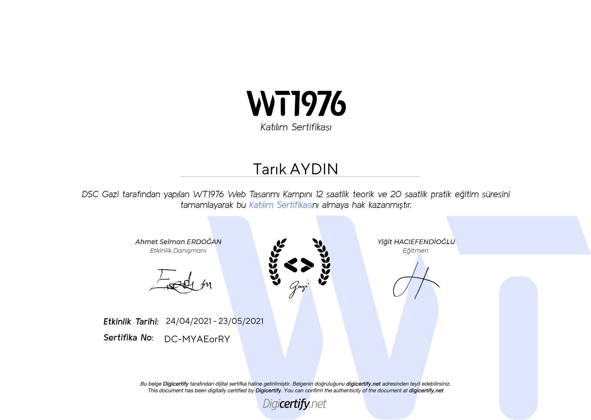
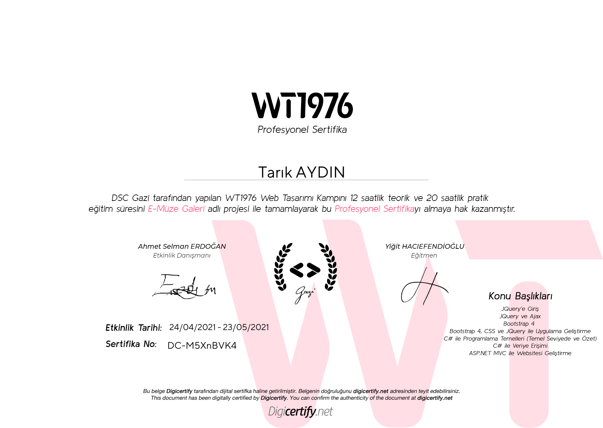

# WT1976-WebTasarimKampi
 Gazi Üniversitesi DSC Kamp Ödevleri ve Proje
 
//PROJE HAKKINDA AÇIKLAMA
E-Müze, 2021 yılının Mayıs ayında Tarık Aydın tarafından geliştirilen bu sanal bir müze ve sergi ortamıdır. 

Bu projenin amacı, Covid-19 pandemisi kısıtlamalarında gidemediğimiz müzeleri, yapılamayan sergileri online platforma taşıyarak
hem insanların evde kaldığı şu zamanlarda vakit geçirecek bir aktivite sağlamak hem de kültürel etkinliklerin devamını sürdürmektir. 
Bu proje, Gazi DSC topluluğunun WT1976 kodlu Web Tasarım Kampı için bitirme projesi olarak hazırlanmıştır.

Asp.Net Mvc ile Entity Framework, Bootstrap ve jQuery kullanarak geliştirdiğim bu projeyi kendi bilgisayarınızda denemek için
MuseumDb.bak isimli veritabanı dosyasını restore etmeniz ve connectionString'i değiştirmeniz gerekmektedir.

 
